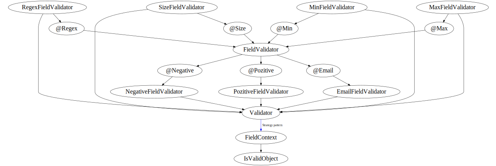

[](https://travis-ci.com/enesusta/tasdik) 
 [](https://github.com/enesusta/tasdik/issues) [](https://github.com/enesusta/bean-validator/blob/master/LICENSE)
[](http://search.maven.org/artifact/com.github.enesusta/tasdik)


#### Maven Dependencies

```xml
<dependency>
  <groupId>com.github.enesusta</groupId>
  <artifactId>tasdik</artifactId>
  <version>1.7.6</version>
</dependency>
```

### Visualisation Of Implementation

